# Marco de Redacción de Propuestas de Investigación en IA - Laboratorio de IA - UNAL Manizales

<p align="center">
  
  <br>
  <a href="https://amalvarezme.github.io/LaboratorioIA_UNAL/">amalvarezme.github.io/LaboratorioIA_UNAL</a>
</p>

Framework multi-agente que produce propuestas de investigación en IA en
**español**, como LaTeX, en `proposal/` (versión de referencia). En paralelo,
los agentes mantienen un mirror Markdown/Obsidian navegable en `vault/`
(`vault/secciones/`, `vault/insumos/`) — capa visual para explorar la
propuesta como grafo de ideas; **nunca** es fuente de verdad, ese rol lo
conserva `proposal/`. **Runtime canónico: Claude Code** (`.claude/agents/` +
`.claude/commands/propuesta.md`, la única fuente editada a mano). **OpenCode**
es un runtime secundario soportado: `.opencode/agents/` +
`.opencode/commands/propuesta.md` se generan de forma determinista y
zero-LLM desde las fuentes de Claude Code (`python3 scripts/gen-opencode.py`
— ver `AGENTS.md` para el detalle y el setup manual pendiente en OpenCode).
El asistente primario despacha 9 subagentes de dominio — `investigador`,
`redactor`, `revisor`, `bibliografo-propuesta`, `presupuestador`,
`insumos-observador`, `disenador-tikz`, `tikz-optimizer`, `revisor-figuras` —
usando el comando `/propuesta` (`.claude/commands/propuesta.md`), siguiendo la
referencia canónica del pipeline en `.claude/agents/coordinador-propuesta.md`
(el 10º archivo de `.claude/agents/`, no se despacha como subagente sino que
documenta el pipeline), avanzando por fases con puertas de revisión (gates).

## Estructura

```
.
├── AGENTS.md                        # Playbook / reglas globales
├── guiaProyectosIA_Agente.md        # Guía autoritativa sección por sección
├── .mcp.json                        # Config de MCP servers
├── info_data/                       # Insumos del usuario (vacío entre corridas)
├── logos/                           # Logos institucionales (branding del repo/README)
├── scripts/                         # Tooling del REPO (no de la propuesta): gen-opencode.py
│                                     #   + gen-opencode.rules.json — generador Claude Code → OpenCode
├── .claude/                         # Runtime canónico — única fuente editada a mano
│   ├── agents/                      # 10 archivos: 9 subagentes + coordinador-propuesta
│   └── commands/
│       └── propuesta.md             # Comando /propuesta
├── .opencode/                       # Runtime secundario — GENERADO desde .claude/, no se edita a mano
│   ├── agents/                      # 9 subagentes portados (1:1 con .claude/agents/, sin coordinador)
│   └── commands/propuesta.md        # Comando /propuesta portado
├── vault/                           # Mirror Obsidian navegable (Markdown) — capa visual, no versión de verdad
│   ├── secciones/                   # Espejo de proposal/sections/*.tex por sección
│   └── insumos/                     # Espejo de proposal/insumos.md
├── proposals/                       # Registro + corridas archivadas de /propuesta
│   └── registry.md                  # Tabla append-only (run-id, estado, archivo, commit)
└── proposal/                        # Framework de salida LaTeX (versión de referencia)
    ├── build.sh                     # Compilación PDF/DOCX
    ├── scripts/                     # compile_tikz.py, prep_docx.py — específico del build LaTeX/DOCX
    ├── logos/                       # Logos institucionales embebidos en el PDF (header/footer)
    ├── templates/reference.docx     # Plantilla pandoc (export DOCX)
    │   # Generados por cada corrida de /propuesta (no committeados):
    └── ...                         #   main.tex, refs.bib, sections/, estado_propuesta.md
```

`scripts/` (raíz) y `proposal/scripts/` son intencionalmente distintos: el
primero es tooling del repo (portabilidad de agentes Claude Code → OpenCode,
no depende de una corrida de `/propuesta`); el segundo es específico del
build LaTeX/DOCX de una corrida (compilación de diagramas TikZ, export a
Word) y solo tiene sentido una vez `proposal/sections/` existe.

## Uso

Ejecuta el comando `/propuesta <idea>` en Claude Code. El asistente primario
despacha la Fase 0 (`insumos-observador` ingiere insumos) y avanza fase por
fase, deteniéndose en cada gate para aprobación del usuario. El mismo
comando también está disponible en OpenCode (`.opencode/commands/propuesta.md`,
generado desde las fuentes de Claude Code) — requiere sesión interactiva:
las compuertas de aprobación no funcionan en `opencode run` headless.

## Flujo del pipeline

Diagrama tipo BPMN del pipeline completo (fases, compuertas de aprobación y
los tres grafos de conocimiento transversales). Fuente editable y notas de
lectura en [`docs/pipeline-flow.md`](docs/pipeline-flow.md).



## Dependencias

- **Claude Code** — runtime canónico del pipeline (`.claude/agents/`, `.claude/commands/propuesta.md`).
- **OpenCode** (opcional) — runtime secundario soportado. `.opencode/agents/` +
  `.opencode/commands/propuesta.md` se regeneran con
  `python3 scripts/gen-opencode.py` (stdlib puro, sin dependencias nuevas);
  requiere además allow-listar los 9 subagentes portados bajo
  `permission.task` en tu `opencode.json` de usuario (setup manual, ver
  docstring de `scripts/gen-opencode.py`). Los 9 agentes generados quedan por
  defecto con `model: openai/gpt-5.4` (`model_map` en
  `scripts/gen-opencode.rules.json`) — es solo el default elegido para este
  repo, no un requisito del generador. Si tu `opencode.json`/`auth login` usa
  otro proveedor (Anthropic, otro modelo OpenAI, etc.), editá `model_map` en
  `gen-opencode.rules.json` y volvé a correr `python3 scripts/gen-opencode.py`
  para regenerar los 9 archivos con el modelo que corresponda.
- **engram** (`brew install gentleman-programming/tap/engram`) — memoria persistente; requerido porque el servidor MCP `engram` de `.mcp.json` invoca este binario directamente.
- **gentle-ai** (recomendado, `brew install gentleman-programming/tap/gentle-ai`) — orquestación del workflow SDD (`/sdd-*`), registro de skills y asignación de modelos por fase.
- LaTeX (pdflatex + bibtex, estilo `natbib`/`apalike`) para compilar `proposal/main.tex`.
- MCP servers usados por los agentes de propuesta: OpenAlex, Crossref, Semantic
  Scholar, PubMed, arXiv, Context7, Consensus. Ver `REQUIREMENTS.md` §1 para el
  detalle de instalación y §3 para el detalle de paquetes; `.mcp.json` registra
  los servidores activos de este proyecto.

## Compilar la propuesta

`proposal/main.tex` no está committeado: se genera en la Fase 7 (ensamble) de
`/propuesta`. Ejecuta el pipeline hasta completarla y luego:

```bash
cd proposal
./build.sh           # o: ./build.sh --manual (pdflatex→bibtex→pdflatex×2)
./build.sh --docx    # exporta a Word vía pandoc
```
