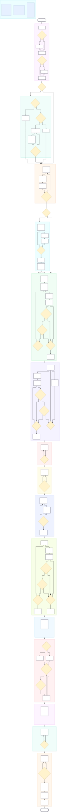

# Marco de Redacción de Propuestas de Investigación en IA - Laboratorio de IA - UNAL Manizales

<p align="center">
  
  <br>
  <a href="https://amalvarezme.github.io/LaboratorioIA_UNAL/">amalvarezme.github.io/LaboratorioIA_UNAL</a>
</p>

Framework multi-agente que produce propuestas de investigación en IA en
**español**, como LaTeX, en `redaccion/` (versión de referencia). En paralelo,
los agentes mantienen un mirror Markdown/Obsidian navegable en
`artefactos/vault/` (`secciones/`, `insumos/`) — capa visual para explorar la
propuesta como grafo de ideas; **nunca** es fuente de verdad, ese rol lo
conserva `redaccion/`.

**Una carpeta de proyecto por corrida.** `/propuesta-init <idea>` crea
`proposals/<run-id>/` y la activa. Adentro hay exactamente cuatro subcarpetas,
y nada queda suelto fuera de ellas salvo el manifiesto `_run.md`:

| Subcarpeta | Contenido | La llena |
|---|---|---|
| `insumos/` | Insumos: TDR, papers, propuestas base, documentos de referencia | el usuario |
| `artefactos/` | Lo generado que no es LaTeX: `estado_propuesta.md`, `insumos.md`, `guia_ajustada_TDR.md`, `pipeline/`, `scoping/papers/`, `vault/` | el pipeline |
| `grafos/` | Reportes de `codebase-memory`: `papers-graph-report.md`, `vault-graph-report.md` | el dispatcher |
| `redaccion/` | El proyecto LaTeX: `main.tex`, `sections/`, `refs.bib`, `main.pdf`, `main.docx` + tooling de build | el pipeline |

Toda ruta `insumos/...`, `artefactos/...`, `grafos/...` o `redaccion/...` del marco
se resuelve contra esa raíz (`RUN_ROOT`). Dos corridas nunca se pisan, y
archivar una es solo un cambio de estado: la carpeta ya **es** el archivo.

**Runtime canónico: Claude Code** (`.claude/agents/` + `.claude/commands/`, la
única fuente editada a mano). **OpenCode**, **Pi** y **Google Antigravity** son runtimes
secundarios soportados: `.opencode/agents/` + `.opencode/commands/` y `.pi/agents/` +
`.pi/prompts/` se generan de forma determinista y zero-LLM desde las fuentes de
Claude Code (`python3 scripts/gen-opencode.py`, `python3 scripts/gen-pi.py`,
`python3 scripts/gen-antigravity.py`; los dos primeros aceptan `--check` — ver `AGENTS.md` y `.pi/README.md` para el detalle).
El asistente primario despacha 9 subagentes de dominio — `investigador`,
`redactor`, `revisor`, `bibliografo-propuesta`, `presupuestador`,
`insumos-observador`, `disenador-tikz`, `tikz-optimizer`, `revisor-figuras` —
usando los comandos `/propuesta` o `/propuesta-continuar` (`.claude/commands/`), siguiendo la
referencia canónica del pipeline en `.claude/agents/coordinador-propuesta.md`
(el 10º archivo de `.claude/agents/`, no se despacha como subagente sino que
documenta el pipeline), avanzando por fases con puertas de revisión (gates).

**Eficiencia de tokens.** El dispatcher lee `guiaProyectosIA_Agente.md` (o la
guía ajustada al TDR generada en G0.5) **una sola vez por corrida** y le
inyecta a cada subagente solo el fragmento de sección que necesita (bloque
`## FRAGMENTO DE GUÍA`, ver "FORMATO EXACTO DE INYECCIÓN" en
`.claude/commands/propuesta.md`), en vez de que cada Task relea el archivo
completo — la única excepción es la auditoría final (Fase 7), que sí necesita
la guía íntegra. `insumos-observador` además cachea en Engram, por hash de
contenido, la extracción de cada archivo de `insumos/`: corridas repetidas
contra el mismo insumo (p. ej. la misma convocatoria) no vuelven a procesarlo
desde cero.

**Telemetría de uso por fase.** El dispatcher lee el bloque `<usage>` que
devuelve cada `Task` delegado (tokens, tool-uses, duración), lo acumula por
fase y lo persiste en `artefactos/pipeline/_estado.md` (columnas `Tokens |
Tool-uses | Duración`) y en el frontmatter de cada evento de fase
(`artefactos/pipeline/<NN>-<fase>.md`: `tokens_total`, `tool_uses`,
`duration_ms`). Cada cierre de gate agrega un 4º punto — "(d) Costo/tiempo" —
a la tríada habitual (resumen, veredicto, aprobación), y la Fase 7 cierra con
una tabla resumen de una fila por fase.

**Bucle de figuras: precheck de overflow y tope de reintentos.** Antes de la
revisión visual de `revisor-figuras`, `redaccion/scripts/compile_tikz.py`
detecta determinísticamente `Overfull \hbox` en el log de `pdflatex` y lo
mapea a la línea del `.tex` fuente (token `OVERFULL: <diagrama> <N>
occurrence(s)`); si `N > 0`, el dispatcher reenvía directo a
`tikz-optimizer` sin gastar el `Read` visual de `revisor-figuras` en esa
iteración. Los 3 bucles de figura (árbol de problemas, estado del arte,
diagrama metodológico) comparten un tope de 4 intentos entre fallos de
overflow y fallos visuales, con escalamiento explícito al usuario si se
agota — nunca reintentan sin límite.

## Estructura

```
.
├── AGENTS.md                        # Playbook / reglas globales
├── guiaProyectosIA_Agente.md        # Guía autoritativa sección por sección
├── .mcp.json                        # Config de MCP servers
├── logos/                           # Logos institucionales (branding del repo/README)
├── scripts/                         # Tooling del REPO (no de la propuesta):
│                                     #   init-run.sh — scaffolding de proposals/<run-id>/ (RUN_ROOT)
│                                     #   gen-opencode.py + .rules.json — puerto Claude Code → OpenCode
│                                     #   gen-pi.py + .rules.json — puerto Claude Code → Pi
│                                     #   gen-antigravity.py + .rules.json — puerto → .agent/
│                                     #   marco_cli.py — CLI portable (marco init/upgrade/status)
│                                     #   convert_to_word.py + apa.csl — export directo a Word
├── .claude/                         # Runtime canónico — única fuente editada a mano
│   ├── agents/                      # 10 archivos: 9 subagentes + coordinador-propuesta
│   └── commands/                    # /propuesta-* + _propuesta-steps.md
├── .opencode/                       # GENERADO (gen-opencode.py) — no editar a mano
│   ├── agents/
│   └── commands/
│       ├── propuesta.md             # Comando /propuesta
│       ├── propuesta-init.md        # Comando /propuesta-init (crea y activa la corrida)
│       └── propuesta-limpiar.md     # Comando /propuesta-limpiar (archiva + resetea, standalone)
├── .opencode/                       # Runtime secundario — GENERADO desde .claude/, no se edita a mano
│   ├── agents/                      # 9 subagentes portados (1:1 con .claude/agents/, sin coordinador)
│   └── commands/                    # los 3 comandos portados
├── .pi/                             # Runtime secundario — GENERADO desde .claude/, no se edita a mano
│   ├── agents/                      # 9 subagentes portados (dispatch con subagent_run)
│   ├── prompts/                     # los 3 comandos portados (slash commands de Pi)
│   └── README.md                    # Único archivo de .pi/ escrito a mano
├── proposals/                       # Corridas — NADA de esto se versiona; init la crea
│   ├── registry.md                  #   Registro local: tabla append-only de metadatos
│   ├── .current-run                 #   Puntero a la corrida activa
│   └── <run-id>/                    #   RUN_ROOT: _run.md + insumos/ + artefactos/
│                                     #     + grafos/ + redaccion/
└── plantilla/                       # Esqueleto LaTeX versionado; init lo copia a cada
                                     #   RUN_ROOT como redaccion/. Único origen; la raíz
                                     #   nunca recibe artefactos de una corrida.
    ├── build.sh                     # Compilación PDF/DOCX
    ├── scripts/                     # compile_tikz.py, prep_docx.py — específico del build LaTeX/DOCX
    ├── logos/                       # Logos institucionales embebidos en el PDF (header/footer)
    ├── templates/reference.docx     # Plantilla pandoc (export DOCX)
    │   # Generados por cada corrida de /propuesta (gitignored, ver "Qué se versiona" abajo):
    └── ...                         #   main.tex, refs.bib, sections/, estado_propuesta.md
```

### Qué se versiona en GitHub (y qué no)

El repo remoto solo contiene lo necesario para **correr el pipeline en
local**: agentes (`.claude/agents/`, `.opencode/agents/`, `.pi/agents/`),
comandos (`.claude/commands/`, `.opencode/commands/`, `.pi/prompts/`),
tooling (`scripts/`,
`plantilla/scripts/`, `plantilla/build.sh`), plantillas/logos
(`plantilla/templates/`, `plantilla/logos/`), la guía
y la guía (`guiaProyectosIA_Agente.md`). **Nada bajo `proposals/` se versiona**,
ni siquiera el registro local: `scripts/init-run.sh` lo recrea si falta, así que
borrar `proposals/` es seguro.

**Nunca** se sincroniza el contenido de una propuesta, ni de la corrida
activa ni de las archivadas: `proposals/<run-id>/` completo está en
`.gitignore`, con sus cuatro subcarpetas, igual que el puntero
`proposals/.current-run`. Archivar no copia nada: `/propuesta-limpiar` (§Uso)
marca la corrida como archivada en su `_run.md` y en el registro local, sin
producir ningún cambio en git, y la siguiente arranca con `/propuesta-init` en
su propia carpeta limpia.

`scripts/` (raíz) y `plantilla/scripts/` son intencionalmente distintos: el
primero es tooling del repo (scaffolding de corridas y portabilidad de agentes
Claude Code → OpenCode/Pi, no depende de una corrida de `/propuesta`); el
segundo es específico del
build LaTeX/DOCX de una corrida (compilación de diagramas TikZ, export a
Word) y solo tiene sentido una vez `redaccion/sections/` de la corrida existe.

## Inicio rápido: proyecto portable

El entrypoint recomendado para corridas reales es `marco init`, que crea
una carpeta de proyecto autocontenida y copiable:

```bash
marco init ~/propuestas/mi-proyecto --title "Título del proyecto"
```

**Cheat-sheet de comandos:**

```bash
marco init <dir> --title "Título de la propuesta"
marco guide <dir>
marco status <dir>
marco upgrade <dir>
marco --help
```

Para el detalle completo de flags, entorno, manifest y flujo, ver
[`docs/marco-cli.md`](docs/marco-cli.md).

> El flujo de trabajar en la raíz del monorepo queda como **demo / dev kit
> workspace**; para corridas reales usá `marco init`.

## Uso

1. `/propuesta-init <idea>` — crea y activa la carpeta de la corrida
   (`proposals/<run-id>/`) con sus cuatro subcarpetas. Delega en
   `scripts/init-run.sh`, determinista e idempotente, que también corre a mano:
   `scripts/init-run.sh <run-id> "<idea breve>"`.
2. `/propuesta-insumos [slug]` — prepara zonas de depósito dentro de
   `insumos/` de la corrida (`tdr/`, `draft/`, `background/`, `doc-secciones/`,
   `ideas/`). No asigna run-id ni despacha agentes: solo ordena dónde dejás los
   archivos.
3. Elegí un modo de ejecución:

**Flujo por pasos (recomendado para operadores):**

```text
/propuesta-analizar [idea]       # intake: clasificación, checklist, TDR/draft, G0.5
/propuesta-continuar             # una unidad por vez; imprime el siguiente comando
```

**Flujo completo (una sesión):** `/propuesta <idea>` — el asistente primario
despacha la Fase 0 y avanza fase por fase, deteniéndose en cada gate.

| Comando | Rol |
|---------|-----|
| `/propuesta-init` | Crea y activa `proposals/<run-id>/` (RUN_ROOT) |
| `/propuesta-insumos` | Zonas `tdr/` `draft/` `background/` `doc-secciones/` `ideas/` |
| `/propuesta-analizar` | Intake + clasificación (idea: args o `ideas/`) |
| `/propuesta-continuar` | Siguiente unidad del pipeline |
| `/propuesta` | Pipeline completo en una sesión |
| `/propuesta-limpiar` | Cierra la corrida activa |

Los mismos comandos se generan para OpenCode (`.opencode/commands/`), Pi
(`.pi/prompts/`) y Google Antigravity (`.agent/workflows/` + skills).
Regenerar tras editar las fuentes de Claude:

```bash
python3 scripts/gen-opencode.py && python3 scripts/gen-pi.py && python3 scripts/gen-antigravity.py
```

Todos requieren sesión **interactiva**: las compuertas de aprobación no
funcionan en modo headless (`opencode run`, `pi -p`). No hay ejecución
desatendida sin gates.

`/propuesta-limpiar` cierra la corrida activa sin tener que arrancar
`/propuesta` primero: con una carpeta por corrida es un cambio de estado en
`_run.md` + el registro local, y deja `proposals/<run-id>/` intacta en disco.

**Guía de operador:** [`docs/usage-modes.md`](docs/usage-modes.md) (modos TDR /
borrador, por pasos vs. completo). "Continuar" un **borrador** (draft-base) es
semilla + reescritura completa, no reanudar `redaccion/sections/` a medias;
`/propuesta-continuar` avanza el **siguiente paso del pipeline**, no un resume
arbitrario a mitad de unidad.

## Flujo del pipeline

Diagrama tipo BPMN del pipeline completo (fases, compuertas de aprobación y las
tres vistas de conocimiento transversales: los dos índices de
`codebase-memory` y el registro del pipeline). Fuente editable y notas de
lectura en [`docs/pipeline-flow.md`](docs/pipeline-flow.md).



## Dependencias

- **Claude Code** — runtime canónico del pipeline (`.claude/agents/`, `.claude/commands/propuesta.md`).
- **OpenCode** (opcional) — runtime secundario soportado. `.opencode/agents/` +
  `.opencode/commands/propuesta.md` se regeneran con
  `python3 scripts/gen-opencode.py` (stdlib puro, sin dependencias nuevas);
  requiere además allow-listar los 9 subagentes portados bajo
  `permission.task` en tu `opencode.json` de usuario (setup manual, ver
  docstring de `scripts/gen-opencode.py`). Los 9 agentes generados quedan por
  defecto con `model: openai/gpt-5.4` (`model_map` en
  `scripts/gen-opencode.rules.json`) — es solo el default elegido para este
  repo, no un requisito del generador. Si tu `opencode.json`/`auth login` usa
  otro proveedor (Anthropic, otro modelo OpenAI, etc.), editá `model_map` en
  `gen-opencode.rules.json` y volvé a correr `python3 scripts/gen-opencode.py`
  para regenerar los 9 archivos con el modelo que corresponda.
- **Pi** (opcional) — runtime secundario soportado. `.pi/agents/` +
  `.pi/prompts/` se regeneran con `python3 scripts/gen-pi.py` (stdlib puro);
  los 9 subagentes quedan en `claude-bridge/claude-sonnet-5` /
  `claude-bridge/claude-opus-5` (`model_map` en `scripts/gen-pi.rules.json`,
  editá y regenerá si usás otro proveedor). Pi los descubre solo (son
  directorios de proyecto estándar) tras conceder trust al proyecto; ver
  `.pi/README.md`.
- **codegraph** (`npm i -g @colbymchenry/codegraph`) — **codebase-memory**, la
  capa de grafo del pipeline; requerido porque el servidor MCP `codegraph` de
  `.mcp.json` invoca este binario (`codegraph serve --mcp`). Reemplaza al
  `graphify` que usó este marco hasta ahora.
- **Google Antigravity** (opcional) — `python3 scripts/gen-antigravity.py`
  → `.agent/skills/` + `.agent/workflows/`.
- **engram** (`brew install gentleman-programming/tap/engram`) — memoria persistente; requerido porque el servidor MCP `engram` de `.mcp.json` invoca este binario directamente.
- **gentle-ai** (recomendado, `brew install gentleman-programming/tap/gentle-ai`) — orquestación del workflow SDD (`/sdd-*`), registro de skills y asignación de modelos por fase.
- LaTeX (pdflatex + bibtex, estilo `natbib`/`apalike`) para compilar `redaccion/main.tex`.
- MCP servers usados por el pipeline: codegraph (codebase-memory), OpenAlex,
  Crossref, Semantic Scholar, PubMed, arXiv, Context7, Consensus. Ver `REQUIREMENTS.md` §1 para el
  detalle de instalación y §3 para el detalle de paquetes; `.mcp.json` registra
  los servidores activos de este proyecto.

## Compilar la propuesta

`main.tex` no está committeado: se genera en la Fase 7 (ensamble) de
`/propuesta`, dentro de la carpeta de la corrida. Ejecuta el pipeline hasta
completarla y luego:

```bash
cd proposals/<run-id>/redaccion
./build.sh           # o: ./build.sh --manual (pdflatex→bibtex→pdflatex×2)
./build.sh --docx    # exporta a Word vía pandoc (acepta opcionalmente --csl <estilo.csl>)
```

`redaccion/build.sh` y `redaccion/scripts/compile_tikz.py` resuelven el proyecto LaTeX como el
directorio que los contiene, sin ninguna ruta fija, así que funcionan en la
carpeta de cualquier corrida sin configuración.

## Pruebas del framework (e2e)

Para verificar la integridad del manifest, comandos del CLI `marco`, generadores de runtime y flags de compilación:

```bash
python3 -m unittest discover -s tests -p "test_*.py"
```

