# Flujo del pipeline `/propuesta`

Diagrama tipo BPMN (fases, compuertas de aprobación, bucles de corrección y los
tres grafos de conocimiento transversales) del pipeline multi-agente descrito
en `.claude/commands/propuesta.md` y `.claude/agents/coordinador-propuesta.md`,
alineado a las 16 secciones de `guiaProyectosIA_Agente.md`.

- **Casillas amarillas**: compuertas de decisión/aprobación (usuario o `revisor`).
- **Casillas azules**: los tres grafos de conocimiento (papers, vault, pipeline),
  que corren en paralelo al flujo principal, no como un paso secuencial más.
- Fuente editable: [`pipeline-flow.mmd`](./pipeline-flow.mmd).
  Figura renderizada: [`pipeline-flow.svg`](./pipeline-flow.svg).
- Para regenerar el SVG tras editar el `.mmd`:
  `npx -y @mermaid-js/mermaid-cli -i docs/pipeline-flow.mmd -o docs/pipeline-flow.svg -b white`.
  Fondo blanco explícito (no transparente): GitHub renderiza SVG embebido en
  markdown contra su propio fondo de página, que cambia con el tema
  claro/oscuro del visitante — un fondo transparente deja el texto y las
  líneas del diagrama con bajo contraste en tema oscuro. El fondo blanco fijo
  garantiza contraste consistente sin importar el tema de quien lo mira.

```mermaid
%%{init: {"flowchart": {"htmlLabels": true, "curve": "linear"}} }%%
flowchart TD
    Start([Usuario invoca /propuesta]) --> F0

    subgraph F0["Fase 0 — Run-id, insumos y clasificacion"]
        RunID[Resolucion run-id] --> Guard{Corrida sin<br/>terminar?}
        Guard -->|si, confirma| Archive[Archivado y reinicio]
        Guard -->|no hay previa| Insumos[Task: insumos-observador]
        Archive --> Insumos
        Insumos --> Ambig{Archivo<br/>ambiguo?}
        Ambig -->|si| AskUser1[Confirmar con usuario]
        AskUser1 --> Route[Clasifica TDR / Draft]
        Ambig -->|no| Route
    end

    F0 --> HasTDR{Hay TDR?}
    HasTDR -->|si| Fase05
    HasTDR -->|no| Fase1a

    subgraph Fase05["Fase 0.5 — GATE G0.5 (opt-in, solo si hay TDR)"]
        Corrob{TDR enumera<br/>secciones?} -->|no, sin doc-secciones| Blocked[BLOQUEADA:<br/>pide documento o continua sin ajuste]
        Corrob -->|si| OptIn{Usuario:<br/>ajustar guia al TDR?}
        OptIn -->|si| GuiaAjustada[Task: investigador<br/>genera guia_ajustada_TDR.md]
        OptIn -->|no| Skip05[G0.5 = OMITIDA-POR-USUARIO]
        GuiaAjustada --> TablaSecciones[Dispatcher: renderiza tabla de<br/>secciones definitivas en consola]
        TablaSecciones --> GateG05{Usuario aprueba<br/>tabla de secciones}
        GateG05 -->|cambios| GuiaAjustada
    end
    GateG05 -->|aprobado| Fase1a
    Skip05 --> Fase1a
    Blocked -.-> Fase1a

    subgraph Fase1a["Fase 1a — COMPUERTA G1a: Scoping temprano (siempre corre)"]
        Scope[Task: bibliografo MODE=scope<br/>5 papers Q1/Q2, menos 2 anos] --> PapersGraph1[Dispatcher: graphify papers/<br/>build completo]
        PapersGraph1 --> EarlyProb[Task: investigador<br/>3 subproblemas tempranos]
        EarlyProb --> GateG1a{Usuario aprueba<br/>papers + grafo + subproblemas}
        GateG1a -->|cambios| Scope
    end

    GateG1a -->|aprobado| CheckG1a{G1a aprobada?}
    CheckG1a -->|si| SubFase1b
    CheckG1a -->|no| Fase1

    subgraph SubFase1b["Fase 1b — COMPUERTA G1b: Expansion SOTA"]
        Corpus[Task: bibliografo MODE=sota<br/>corpus 30-40 papers] --> PapersGraphUpd[Dispatcher: graphify --update]
        PapersGraphUpd --> Grouping[Task: bibliografo<br/>agrupacion 3-5 subsecciones]
        Grouping --> GateG1b{Usuario aprueba}
        GateG1b -->|cambios| Corpus
        GateG1b -->|aprobado| WriteRefs[Task: bibliografo<br/>WRITE-REFS: refs.bib]
        WriteRefs --> VaultBuild[Dispatcher: graphify vault/<br/>build completo, primera vez]
    end
    VaultBuild --> Fase1
    SubFase1b -.-> Fase1

    subgraph Fase1["Fase 1 — Descripcion del problema (sec 3)"]
        Explore[Task: bibliografo MODE=explore<br/>mapa amplio, mas de 5 obras] --> Invest1[Task: investigador<br/>sec 3 subproblemas + pregunta de investigacion]
        Invest1 --> Tikz1[Task: disenador-tikz<br/>arbol de problemas]
        Tikz1 --> Opt1[Task: tikz-optimizer<br/>compila PNG + token OVERFULL]
        Opt1 --> Overfull1{Precheck determinista:<br/>OVERFULL N mayor que 0?}
        Overfull1 -->|si| Cap1{Intentos<br/>4/4?}
        Overfull1 -->|no, log limpio| RevFig1{Task: revisor-figuras<br/>PASS/FAIL}
        RevFig1 -->|FAIL| Cap1
        Cap1 -->|no, +1 intento| Opt1
        Cap1 -->|si, agotado| Escal1[Escala a usuario:<br/>diagrama, 4/4 intentos, ultimo hallazgo]
        RevFig1 -->|PASS| Gate1{GATE revisor<br/>+ evidencia de grafo}
        Gate1 -->|FAIL| Invest1
    end
    Fase1 --> Fase2

    subgraph Fase2["Fase 2 — Estado del arte + Hipotesis (sec 4, 5)"]
        Sota2[Task: bibliografo sec 4<br/>estado del arte, 30+ refs Q1/Q2] --> Hip2["Task: investigador sec 5<br/>hipotesis (en paralelo)"]
        Sota2 --> Tikz2[Task: disenador-tikz<br/>mapa estado del arte]
        Tikz2 --> Opt2[Task: tikz-optimizer<br/>compila PNG + token OVERFULL]
        Opt2 --> Overfull2{Precheck determinista:<br/>OVERFULL N mayor que 0?}
        Overfull2 -->|si| Cap2{Intentos<br/>4/4?}
        Overfull2 -->|no, log limpio| RevFig2{Task: revisor-figuras<br/>PASS/FAIL}
        RevFig2 -->|FAIL| Cap2
        Cap2 -->|no, +1 intento| Opt2
        Cap2 -->|si, agotado| Escal2[Escala a usuario:<br/>diagrama, 4/4 intentos, ultimo hallazgo]
        RevFig2 -->|PASS| Gate2{GATE revisor}
        Hip2 --> Gate2
        Gate2 -->|FAIL| Sota2
    end
    Fase2 --> Fase3

    subgraph Fase3["Fase 3 — Justificacion y pertinencia (sec 2)"]
        Redactor3["Task: redactor sec 2<br/>6+ parrafos, 10+ refs Q1/Q2"] --> Gate3{GATE revisor}
        Gate3 -->|FAIL| Redactor3
    end
    Fase3 --> Fase4

    subgraph Fase4["Fase 4 — Objetivos (sec 6, 7)"]
        Invest4[Task: investigador<br/>sec 6 objetivo general + sec 7 especificos] --> Gate4{GATE revisor:<br/>subproblema to objetivo 1:1, sin TRL textual}
        Gate4 -->|FAIL| Invest4
    end
    Fase4 --> Fase5

    subgraph Fase5["Fase 5 — Marco conceptual + Equipo de trabajo (sec 8, 9)"]
        Invest5[Task: investigador sec 8<br/>marco conceptual] --> Redactor5a["Task: redactor sec 9<br/>equipo de trabajo (roles desde sec 7)"]
        Redactor5a --> Gate5{GATE revisor<br/>+ evidencia de grafo}
        Gate5 -->|FAIL| Invest5
        Gate5 -->|aprobado| PDF5[Dispatcher: ensambla/compila<br/>main.tex a main.pdf]
    end
    Fase5 --> Fase55

    subgraph Fase55["Fase 5.5 — Metodologia (sec 10)"]
        Redactor5b[Task: redactor sec 10<br/>metodologia] --> Tikz5[Task: disenador-tikz<br/>diagrama metodologico]
        Tikz5 --> Opt5[Task: tikz-optimizer<br/>compila PNG + token OVERFULL]
        Opt5 --> Overfull5{Precheck determinista:<br/>OVERFULL N mayor que 0?}
        Overfull5 -->|si| Cap5{Intentos<br/>4/4?}
        Overfull5 -->|no, log limpio| RevFig5{Task: revisor-figuras<br/>PASS/FAIL}
        RevFig5 -->|FAIL| Cap5
        Cap5 -->|no, +1 intento| Opt5
        Cap5 -->|si, agotado| Escal5[Escala a usuario:<br/>diagrama, 4/4 intentos, ultimo hallazgo]
        RevFig5 -->|PASS| Gate55{GATE revisor<br/>+ evidencia de grafo}
        Gate55 -->|FAIL| Redactor5b
        Gate55 -->|aprobado| PDF55[Dispatcher: ensambla/compila<br/>main.tex a main.pdf]
    end
    Fase55 --> Fase6

    subgraph Fase6["Fase 6 — Resultados + Consideraciones eticas (sec 11, 12)"]
        Redactor6["Task: redactor sec 11 resultados esperados<br/>Task: redactor sec 12 consideraciones eticas"]
    end
    Fase6 --> Fase64

    subgraph Fase64["Fase 6.4 — COMPUERTA INTERACTIVA G-Presupuesto (sec 13)"]
        ModeRes{TDR trae marco<br/>presupuestal?} -->|si, con tope| PresupTDR[Task: presupuestador MODE=tdr]
        ModeRes -->|no, sin datos| PresupBase[Task: presupuestador MODE=base]
        PresupTDR --> LoopP{Usuario itera<br/>linea por linea, sin tope de rondas}
        PresupBase --> LoopP
        LoopP -->|feedback| Presup2[Task: presupuestador<br/>revisa tabla + self-audit]
        Presup2 --> LoopP
        LoopP -->|aprobacion explicita| GateP{GATE revisor:<br/>aritmetica + tope + rubros}
        GateP -->|FAIL| Presup2
    end
    Fase64 --> Fase645

    subgraph Fase645["Fase 6.45 — Cronograma + Productos esperados (sec 14, 15)"]
        Redactor645["Task: redactor sec 14 cronograma (Gantt)<br/>Task: redactor sec 15 productos esperados"]
    end
    Fase645 --> Fase65

    subgraph Fase65["Fase 6.5 — Front-matter (Resumen, Resumen ejecutivo, Palabras clave)"]
        Redactor65[Task: redactor<br/>sintesis del documento completo, sec 1-16 aprobadas] --> Gate65{GATE revisor}
        Gate65 -->|FAIL| Redactor65
    end
    Fase65 --> Fase7

    subgraph Fase7["Fase 7 — Auditoria final + Ensamble"]
        VaultFinal[Dispatcher: graphify vault/ completo<br/>todas las secciones] --> AuditFinal{GATE revisor:<br/>auditoria final, incl. Presupuesto to Cronograma}
        AuditFinal -->|FAIL| VaultFinal
        AuditFinal -->|PASS| Assemble[Asistente primario ensambla main.tex:<br/>front-matter, sec 1-16 en orden]
        Assemble --> PDF[build.sh to main.pdf<br/>logos: header UNAL, footer GCPDS/LabIA]
        PDF --> DOCX[build.sh --docx to main.docx<br/>tikz a PNG, tablas editables]
    end
    Fase7 --> End([Propuesta final: PDF + DOCX])

    subgraph Grafos["Grafos transversales (3, corren en paralelo al flujo principal)"]
        GPapers["Grafo de papers<br/>proposal/scoping/graphify-out/<br/>seed G1a, refresca en G1b y Fase 2"]
        GVault["Grafo de vault (coherencia)<br/>vault/graphify-out/<br/>build completo en G1b, --update en cada gate Fase 1-7"]
        GPipeline["Grafo de pipeline (estructura)<br/>proposal/pipeline/NN-fase.md (eventos) + _estado.md<br/>un evento .md por transicion de compuerta, sin graphify (build/update/export eliminados)"]
    end

    classDef gate fill:#fff3cd,stroke:#b8860b,stroke-width:1px
    classDef graph3 fill:#e6f0ff,stroke:#4a6fa5,stroke-width:1px
    class Guard,Ambig,HasTDR,Corrob,OptIn,GateG05,GateG1a,CheckG1a,GateG1b,Overfull1,Cap1,RevFig1,Gate1,Overfull2,Cap2,RevFig2,Gate2,Gate3,Gate4,Gate5,Overfull5,Cap5,RevFig5,Gate55,ModeRes,LoopP,GateP,Gate65,AuditFinal gate
    class GPapers,GVault,GPipeline graph3
```

## Notas de lectura

- Las compuertas `GATE revisor` de las Fases 1-5.5, más la Fase 6.4 de
  Presupuesto, reciben el bloque `EVIDENCIA DE GRAFO` inyectado por el
  dispatcher a partir del grafo de vault actualizado — es asesor, nunca
  cambia el veredicto por sí solo. La Fase 6.5 (front-matter) NO recibe este
  bloque: su `GATE revisor` solo valida las 3 secciones preliminares contra
  la guía.
- La Fase 6.4 (Presupuesto) es la única compuerta genuinamente interactiva:
  no tiene tope de rondas y el dispatcher nunca aprueba en silencio.
- Fase 0.5, 1a y 1b son condicionales: 0.5 solo corre si hay TDR; 1b solo si
  1a cerró aprobada.
- El nodo `Archive[Archivado y reinicio]` de la Fase 0 también es invocable
  standalone vía `/propuesta-limpiar`, sin necesidad de arrancar `/propuesta`
  primero — mismo procedimiento, mismo bloque ARCHIVADO-Y-REINICIO. En
  ambos casos el archivado es **solo local** (`proposals/<run-id>/` está
  gitignored): GitHub nunca recibe el contenido de una propuesta, activa o
  archivada — solo el esqueleto del framework.
- El gate G0.5 no presenta un resumen en prosa de `guia_ajustada_TDR.md`: el
  dispatcher copia la "Tabla de secciones definitivas" (§, Sección,
  Alcance/ajuste frente al TDR, Prioridad, Owner) completa y la renderiza
  como tabla Markdown directamente en el chat; la aprobación/ajuste del
  usuario se resuelve sobre esa tabla, no sobre el documento en general.
- El Cronograma de actividades (§14) se redacta en la Fase 6.45, **después**
  del Presupuesto (§13, Fase 6.4), aunque §14 sea referenciado desde §13
  (referencia hacia adelante); la coherencia Presupuesto↔Cronograma se
  verifica en firme en la auditoría final de la Fase 7.
- Fase 6 y 6.45 no tienen compuerta `GATE revisor` propia: se auditan en
  bloque en la Fase 7, igual que en el diseño original.
- **Fase 5 vs. Fase 5.5**: la Fase 5 (marco conceptual §8 + equipo de
  trabajo §9) y la Fase 5.5 (metodología §10 + su propio bucle de figura)
  son dos compuertas `GATE revisor` separadas, cada una seguida de un
  ensamblado/compilación de `main.pdf` — no una única fase combinada.
- **Bucle de figuras — precheck de overflow y tope de reintentos**: en los 3
  bucles (árbol de problemas, mapa de estado del arte, diagrama
  metodológico), `tikz-optimizer` compila y `proposal/scripts/compile_tikz.py`
  detecta determinísticamente `Overfull \hbox` en el log de `pdflatex`
  (token `OVERFULL: <diagrama> <N> occurrence(s)`). Si `N > 0`, el
  dispatcher vuelve directo a `tikz-optimizer` con la línea mapeada,
  saltando `revisor-figuras` esa iteración; solo con el log limpio pasa a
  la revisión visual. El contador de intentos es compartido entre fallos de
  overflow y fallos visuales, con tope de 4 por diagrama y por corrida — al
  agotarse, el dispatcher escala al usuario en vez de reintentar sin límite.
